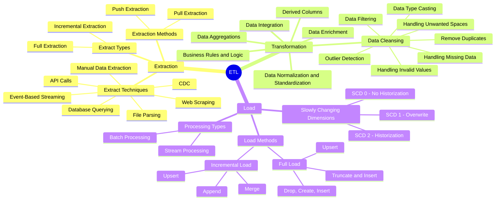
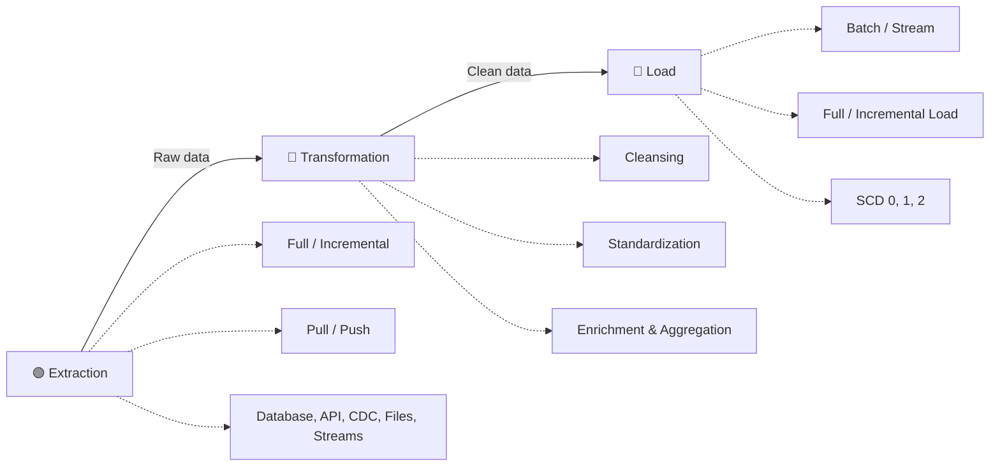

# ETL Methods

A complete reference of the techniques, methods, and patterns used at each stage of an ETL pipeline — Extraction, Transformation, Load, and Slowly Changing Dimensions.

---

## 🌐 Overview Mind Map

---

## 🟢 Extraction

The first stage — pulling data from one or more source systems into the staging area.

### Extract Types

| Type | Description |
|---|---|
| **Full Extraction** | Pull the entire dataset every time the pipeline runs. Simple, but expensive at scale. |
| **Incremental Extraction** | Pull only the new or changed records since the last load. Efficient, but requires a tracking mechanism (timestamp, watermark, CDC). |

### Extraction Methods

| Method | Description |
|---|---|
| **Pull Extraction** | The pipeline reaches out to the source and requests the data. |
| **Push Extraction** | The source actively sends data to the pipeline (e.g., webhooks, event streams). |

### Extract Techniques

| Technique | Use Case |
|---|---|
| **Manual Data Extraction** | One-off exports done by hand (CSV downloads, screen scraping). |
| **Database Querying** | Direct SQL queries against operational databases. |
| **File Parsing** | Reading flat files like CSV, JSON, XML, or Parquet. |
| **API Calls** | Calling REST or GraphQL endpoints to fetch data. |
| **Event-Based Streaming** | Consuming events from message brokers (Kafka, Kinesis, Pub/Sub). |
| **CDC** (Change Data Capture) | Tracking row-level changes in source databases via transaction logs. |
| **Web Scraping** | Extracting data from rendered web pages when no API is available. |

---

## 🔴 Transformation

The middle stage — cleaning, conforming, and reshaping data so it's ready for downstream use.

### Core Transformations

| Transformation | Purpose |
|---|---|
| **Data Enrichment** | Adding new context to records by joining with reference data. |
| **Data Integration** | Merging records from multiple source systems into one unified view. |
| **Derived Columns** | Computing new fields from existing ones (e.g., `age = today − birthdate`). |
| **Data Normalization & Standardization** | Putting values into a consistent format (units, casing, formats). |
| **Business Rules & Logic** | Applying domain rules (e.g., flagging high-value customers). |
| **Data Aggregations** | Summarizing rows into totals, averages, or counts. |

### Data Cleansing (a sub-discipline of Transformation)

| Operation | What It Handles |
|---|---|
| **Remove Duplicates** | Drops repeated records using business keys or row hashes. |
| **Data Filtering** | Excludes rows that don't meet quality or scope criteria. |
| **Handling Missing Data** | Decides how to treat NULLs — fill, drop, or flag. |
| **Handling Invalid Values** | Replaces or rejects values outside the expected domain. |
| **Handling Unwanted Spaces** | Trims leading/trailing whitespace and collapses internal gaps. |
| **Data Type Casting** | Converts strings to numerics, dates to timestamps, etc. |
| **Outlier Detection** | Identifies and handles values that deviate significantly from the norm. |

---

## 🔵 Load

The final stage — writing the transformed data into the target system (warehouse, data mart, lakehouse).

### Processing Types

| Type | Description |
|---|---|
| **Batch Processing** | Runs on a schedule (hourly, nightly), loading a chunk of records at a time. |
| **Stream Processing** | Continuously loads records as they arrive, often within seconds. |

### Load Methods

#### Full Load

Replaces the entire target table on every run.

| Strategy | Description |
|---|---|
| **Truncate & Insert** | Empties the table, then loads the fresh data. |
| **Upsert** | Inserts new rows and updates existing ones (also known as merge). |
| **Drop, Create, Insert** | Drops the table entirely and recreates it from scratch. |

#### Incremental Load

Only writes the changed or new records since the last load.

| Strategy | Description |
|---|---|
| **Upsert** | Inserts new rows and updates rows that already exist. |
| **Append** | Adds new rows to the end of the table without touching existing ones. |
| **Merge** | Combines insert, update, and (optionally) delete in one operation. |

### Slowly Changing Dimensions (SCD)

Strategies for handling changes to dimension records over time.

| Type | Behavior |
|---|---|
| **SCD 0** — No Historization | Once written, values never change. |
| **SCD 1** — Overwrite | Old values are replaced; no history is preserved. |
| **SCD 2** — Historization | Each change creates a new row, preserving the full history with effective dates. |
| **SCD 3+** | Specialized variants for partial history tracking (e.g., previous-value columns). |

---

## 📌 Quick Reference

---

## 💡 Key Takeaway

Each ETL stage has its own set of design decisions:

- **Extraction** decisions affect *cost* and *latency* — full vs. incremental, pull vs. push.
- **Transformation** decisions affect *data quality* and *trust* — what gets cleaned, normalized, enriched, and how aggressively.
- **Load** decisions affect *historical analysis* — whether you keep history (SCD 2), only the latest snapshot (SCD 1), or rebuild every run (full load).

Picking the right combination depends on your data volume, freshness requirements, and the analytical questions your warehouse is meant to answer.
